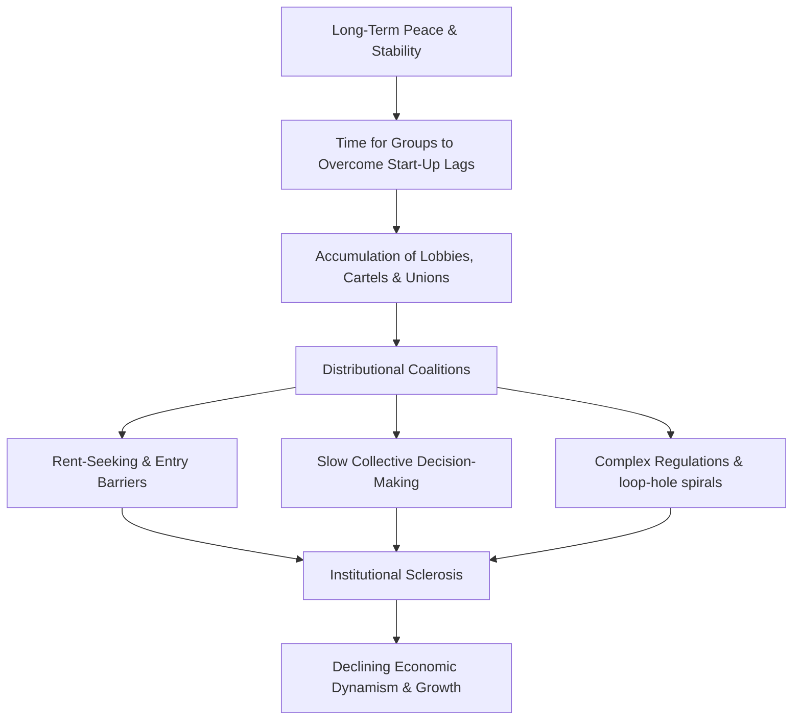

# Institutional Sclerosis (Olson)
> The gradual accumulation of interest groups and cartels in stable societies over time, which reduces economic dynamism, complicates regulation, and leads to relative decline.

## Summary

In *The Rise and Decline of Nations* (1982), Mancur Olson presents his central historical thesis: **long-term stability, peace, and unchanged boundaries lead to the accumulation of distributional coalitions, resulting in a structural decline in economic growth and social flexibility.** This condition is known as **institutional sclerosis**.

### The Sclerosis Mechanism

The mechanism operates through several steps:

1. **The Start-Up Lag**: Establishing a collective-action organization (like a lobby or union) is difficult and time-consuming because of the free-rider problem. It requires favorable circumstances, entrepreneurial leadership (e.g., Jimmy Hoffa), and time to find selective incentives.
2. **Accumulation Over Time**: Once established, organizations rarely dissolve because leaders have a strong self-interest in preserving them (Weber's bureaucratic survival). Thus, in a stable society, the number of coalitions grows cumulatively over time.
3. **Cartelization and Entry Barriers**: As these coalitions accumulate, they establish cartels, fix prices, restrict membership, and lobby for protective tariffs, licenses, and regulations. They build barriers to entry to protect their share of the national income.
4. **Slowing Down Innovation**: Coalitions decide slowly due to internal bargaining, and they protect their existing assets and practices. They systematically resist technological change and resource reallocation (Hicksian barriers to adjustment), which would devalue their specialized monopolies.
5. **Regulatory Complexity**: To protect their monopolies from competitors seeking loop-holes, coalitions lobby for increasingly complex regulations (the Schultze dynamic loop). This increases the scale of government, changes the direction of social evolution, and silts up the channels of economic progress.

### Historical Case Studies

Olson tests his theory against several dramatic rises and declines:

* **The post-WWII "Economic Miracles" (Germany and Japan)**: Totalitarianism (Hitler, militarism) and Allied occupation (purges, decartelization decrees of 1947) swept away the existing interest groups. When stable democratic orders were established postwar, these societies grew incredibly fast because they were temporarily free of institutional sclerosis.
* **The "British Disease"**: Great Britain had enjoyed the longest period of continuous stability and peace of any developed country, free from domestic revolution, foreign conquest, or major dictatorship since the 17th century. Consequently, it accumulated the dense network of narrow interest groups that eventually caused its relative postwar decline.
* **U.S. Regional Patterns**: States in the South and West, which were settled later or experienced the institutional disruption of the Civil War and Reconstruction, grew faster in the mid-20th century than the older, highly stable states of the Northeast and Middle West, which had accumulated dense networks of coalitions.

## Key Claims / Positions

### How Different Thinkers Approach This

- **Universalist Historians (Spengler, Toynbee)**: Tried to explain the rise and fall of civilizations through organic cycles of birth, maturity, decay, and death. Olson rejects these universalist frameworks as unscientific, replacing them with a parsimonious microeconomic mechanism based on group logic.
- **[[Thinkers/Karl Marx]]**: Traced the internal contradictions of capitalism to class struggle. Olson reinterprets the "internal contradiction" of stable societies: the very peace and stability that allow capitalism to flourish also permit the gradual accumulation of coalitions that ultimately undermine its dynamism.
- **[[Thinkers/Thomas Hobbes]]**: In *Leviathan*, Hobbes argued that absolute state sovereignty is necessary to secure peace and stability. Olson opens a post-Hobbesian paradox: the long-term stability Hobbes sought is the exact environment in which growth-repressing cartels accumulate.

## Contradictions / Open Questions

- > [!warning] Olson's thesis suggests that severe shocks (like war or defeat) have a beneficial "cleansing" effect on institutions. This leads to a troubling paradox: how can a society maintain both long-term peace and institutional dynamism without requiring destructive disruptions?
- The model is highly parsimonious, but critics argue it underestimates how institutional design, political leadership, and constitutional rules (such as Switzerland's decentralization) can mitigate sclerosis without requiring shocks.

## Sources

- [[Sources/The Rise and Decline of Nations - Mancur Olson (1982)]]

## Related

- [[Thinkers/Mancur Olson]]
- [[Concepts/Collective Action and Free Riding (Olson)]]
- [[Concepts/Distributional Coalitions (Olson)]]
- [[Concepts/Encompassing Organizations (Olson)]]
- [[Concepts/Jurisdictional Integration and Sclerosis (Olson)]]
- [[Thinkers/Thomas Hobbes]]
- [[Thinkers/Karl Marx]]
