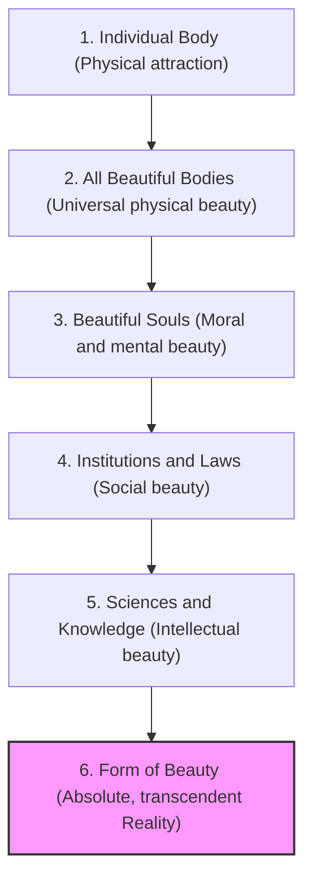

# Ladder of Love and Form of Beauty (Plato Symposium)

> The Platonic metaphysical path of ascent (recounted by Diotima) through which a person moves from physical attraction to individual bodies to the intellectual contemplation of absolute, transcendent Beauty (the Form of Beauty).

## Summary

The **Ladder of Love** is the classic description of Platonism as a lived, spiritual, and intellectual path. It shows how the human drive of **Eros** (desire, love)—which initially manifests as physical attraction and the urge to reproduce—can be educated, refined, and redirected (*sublimated*) toward higher, non-sensible realities, culminating in the direct intellectual apprehension of the **Form of Beauty**.

---

## The Six Rungs of the Ladder

1. **A Single Beautiful Body**: The lover is drawn to the physical beauty of a single person, generating beautiful thoughts in return.
2. **All Beautiful Bodies**: The lover realizes that the beauty of one body is sibling to the beauty of another; they become a lover of physical beauty in general, relaxing their intense attachment to the single individual.
3. **Beautiful Souls**: The lover values the beauty of mind, character, and virtue above physical beauty, caring for and nourishing those who are noble in soul even if they are plain in body.
4. **Institutions, Customs, and Laws**: The lover is led to contemplate the beauty of human institutions and laws, realizing that all physical and moral beauty is related and of one family.
5. **The Sciences (Knowledge)**: The lover turns their attention to the beauty of intellectual and scientific discovery, escaping narrow attachments to love the "great sea of beauty" in knowledge.
6. **The Form of Beauty (Auton to Kalon)**: The ultimate revelation. The lover suddenly beholds a beauty that is:
   - *Eternal*: Neither generated nor destroyed, neither waxing nor waning.
   - *Absolute*: Pure, unmixed, not relative to time, place, or perspective.
   - *Immaterial*: Not existing in a face, hand, or physical body, nor in any speech or science.
   - *Transcendent*: Existing by itself, unique, and eternal, while all other beautiful things participate in it.

---

## Metaphysical and Epistemological Impact

- **Eros as Epistemic Driver**: Plato demonstrates that philosophy is not a cold, purely logical exercise, but is driven by a deep, passionate desire (*Eros*) for truth, goodness, and beauty.
- **The Idealist Standard**: Establishes the core idealist premise that physical beauty is merely a low, imperfect reflection of an immaterial, eternal reality.
- **Downstream Influence**: 
  - **Neoplatonism**: Plotinus ([[Thinkers/Plotinus]]) adapted this ascent into the soul's mystical return (*epistrophe*) to the One via contemplation.
  - **Augustine**: Augustine ([[Thinkers/Augustine]]) Christianized this ladder, treating the ascent of love as the soul's restless journey home to God.

## Related Pages
- [[Sources/Symposium - Plato]]
- [[Thinkers/Plato]]
- [[Thinkers/Plotinus]]
- [[Thinkers/Augustine]]
- [[Concepts/Emanation (Proodos)]]

## Contradictions / Open Questions
- > [!warning] The Devaluation of the Particular: Does the ascent of the ladder require the lover to discard and abandon their love for individual human beings? Critics argue that Plato's ladder is ultimately cold and egoistic, treating human relationships as mere stepping stones to be cast aside once the Form is reached.
