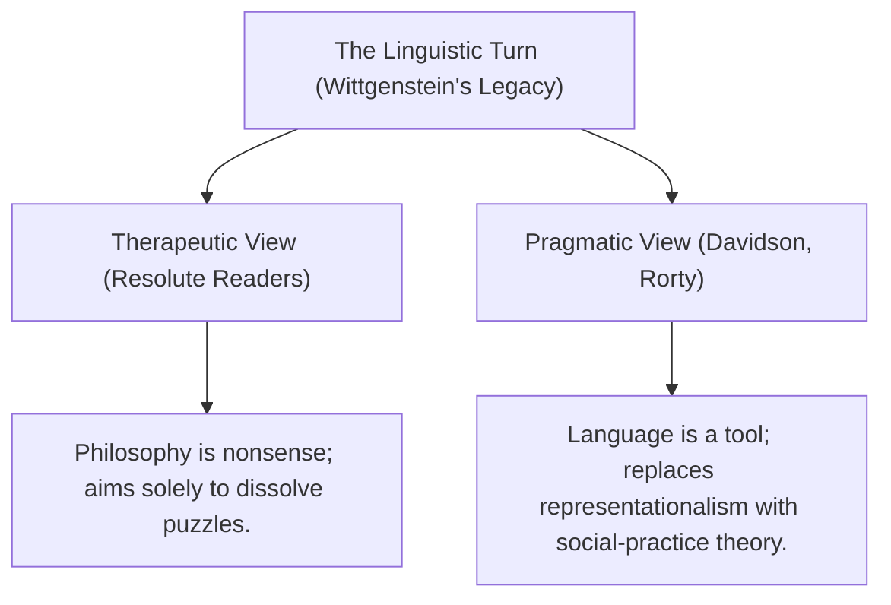

# Linguistic Turn (Rorty)
> The historical shift in 20th-century philosophy that prioritized the analysis of language to solve or dissolve philosophical problems, analyzed by Richard Rorty as a transition from representationalism to social-practice pragmatism.

## Concept Overview
The term "the linguistic turn" was coined by Gustav Bergmann and popularized by Richard Rorty's 1967 anthology of the same name. Rorty argues that the historical value of the linguistic turn was that it shifted the focus of philosophy away from the Cartesian-Lockean "theatre of inner experience" (mental representations) and toward observable **linguistic behavior**. This behavioral shift laid the groundwork for dismantling representationalism.

## The Dual Interpretations of the Later Wittgenstein

In his essay "Wittgenstein and the Linguistic Turn" (2010), Rorty argues that the *Philosophical Investigations* has been read in two conflicting ways:

### 1. The Therapeutic View ("Resolute Reading")
- **Proponents**: James Conant, Cora Diamond, Alice Crary, Warren Goldfarb, and Thomas Ricketts.
- **Thesis**: Wittgenstein did not offer any positive theories of meaning, mind, or language. His goal was purely therapeutic: using language to show that philosophical questions are plain, ungrammatical nonsense. Philosophy is a "battle against the bewitchment of our intelligence" (PI 109). Rorty calls this a form of "quietism" which insists that there are no philosophical facts or theories to be discovered.

### 2. The Pragmatic View
- **Proponents**: Donald Davidson, Robert Brandom, Wilfrid Sellars, and Richard Rorty.
- **Thesis**: Wittgenstein's work contains a positive, naturalistic contribution to philosophy: replacing the "picture theory" of meaning with a **social-practice theory of meaning**. Meaning is use, and language-games are social practices designed to achieve human purposes. Rather than just dissolving nonsense, this view provides a constructive, pragmatist alternative to traditional representationalism.

Rorty concludes that while the therapeutic reading represents Wittgenstein's own self-conscious intentions, the pragmatic reading is far more useful for the future of philosophy because it offers a positive vocabulary for describing human communication and cooperation.

## Related Pages
- [[Thinkers/Richard Rorty]]
- [[Thinkers/Ludwig Wittgenstein]]
- [[Sources/Wittgenstein’s Philosophical Investigations - A Critical Guide - Ahmed (2010)]]
- [[Concepts/Philosophy as Therapy (Wittgenstein)]]
