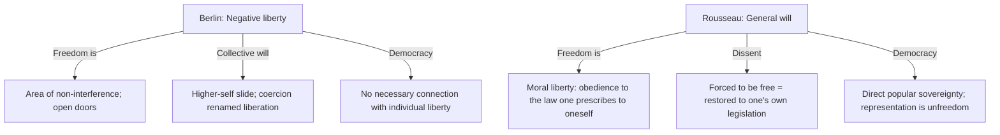

# Berlin vs Rousseau — Negative Liberty vs Forced to Be Free

> Whether obedience to a collective will can *be* freedom, or whether that identification is the type-case of domination traveling under freedom’s name.

Berlin is **not a vault primary**. Position A is reported from the 2013 Baum/Nichols reception of “Two Concepts of Liberty” (Hardy *Liberty*: TC / IN). Position B is from the vault’s Rousseau primary, *The Social Contract*. Do not treat this page as a Berlin ingest.

## The Conflict

### Position A: Negative Liberty (Berlin, as this volume quotes him)

- **Core claim.** Political liberty is the area within which a person can act unobstructed by others (TC, 169). The wider that area, the wider the freedom. Positive liberty as self-mastery splits the self into a higher rational self and a lower empirical self; the “real self” may be “a tribe, a race, a church, [or] a state” (TC, 179). Then “to force empirical selves into the right pattern is not tyranny but liberation” (TC, 194).
- **The Rousseau passage he uses.** The social compact “tacitly includes… that whoever refuses to obey the general will shall be constrained to do so by the entire body: which means nothing other than that he shall be forced to be free” (*Social Contract* I.7, as the editors quote it). For Berlin this is the exemplar of coercion justified as liberty — the inversion.
- **Corollaries.** Democratic self-government is “not the government ‘of each by himself’ but, at best, of ‘each by all the rest’” (TC, 208–209). “There is no necessary connection between individual liberty and democratic rule”; negative liberty “is not incompatible with some kinds of autocracy” (TC, 177). Education-as-compulsion (Fichte: “Compulsion is also a kind of education,” TC, 195) is the paternalist twin of the same slide.
- **Key anchors.** [[Thinkers/Isaiah Berlin]], [[Concepts/Negative and Positive Liberty (Berlin)]], [[Concepts/Liberty versus the Conditions of Liberty (Berlin)]], [[Sources/Isaiah Berlin and the Politics of Freedom - Baum and Nichols (2013)]].

### Position B: Moral Liberty and the General Will (Rousseau)

- **Core claim.** Citizens are free when they obey laws they have collectively made. The [[Concepts/General Will (Rousseau)|general will]] is not the sum of private interests (the will of all) but the common interest when citizens vote as members of the sovereign. “Man is born free, and everywhere he is in chains.” The contract is supposed to unite them while leaving them as free as before — by alienating rights to the *whole* community, not to a master.
- **“Forced to be free.”** Disobedience is a contradiction of the citizen’s own rational will. Constraint by the body restores the dissenter to self-legislated freedom and “guarantees him against all personal dependence.” What is lost is “natural freedom,” an unlimited right to whatever one can reach; what is gained is civil freedom and **moral freedom**, “which alone makes man truly the master of himself; for the impulsion of mere appetite is slavery, and obedience to the law one has prescribed to oneself is freedom” (I.8).
- **Corollaries.** Sovereignty is inalienable and indivisible; representation is unfreedom. The general will requires a small, relatively homogeneous people. True freedom is not a private area left alone by power; it is participation in the power that binds.
- **Key anchors.** [[Thinkers/Jean-Jacques Rousseau]], [[Concepts/General Will (Rousseau)]], [[Sources/The Social Contract - Jean-Jacques Rousseau (1762)]].

## What Each Side Already Concedes

- **Rousseau** distinguishes general will from will of all and knows factions corrupt the former. He is not saying every act of a majority is freedom. The vault’s own Rousseau page already records the “totalitarian potential” critics (including Berlin) see.
- **Berlin (1969)** admits the two questions “cannot be kept wholly distinct” (IN, 35–36), that “freedom for the wolves has often meant death to the sheep” (IN, 38), and that a welfare-state case can be built from negative liberty. He does not retract the reading of I.7.
- **Dimova-Cookson** (this volume) tries to save both: social positive liberty as the *association* of exercise with justice is Green/Rousseau, *not* the totalitarian debasement Berlin fuses with it.
- **Myers:** Berlin’s democracy critique is sharpest against Rousseauian rational consensus; that is not a reason to smear every democratic self-rule with despotism.

## A Third Horn Already in This Volume: Liberal Despotism

Tully and the editors reverse the charge. If negative liberty has institutional **conditions** (law, property, contract, “readiness”), then imposing those conditions on peoples “not ready” — Mill’s “severe discipline,” Berlin’s “liberal-minded despots” (TC, 175–176), McKinley’s “benevolent assimilation” — is coercion in *negative* liberty’s name. Same inversion, other banner. Crowder denies the attribution: Berlin rejects “White Man’s Burdens” and later defends decolonized self-determination. The horn stays open because it is a debate *about* Berlin, not a second Rousseau.

Pettit (workshop presence, no chapter): defining liberty as non-interference cannot see the slave of a benevolent master — unfreedom as **domination**, not interference. That is a republican third, not Rousseau’s general will.

## Vault Neighbors

- **[[Thinkers/Kant]]:** moral freedom as self-legislation is the closest *philosophical* kin of Rousseau’s I.8, and a step in Berlin’s slide. Kant’s CI is not a vote of the assembled people. See [[Concepts/Freedom as the Key to Autonomy (Kant)]].
- **[[Thinkers/John Stuart Mill]]:** tyranny of the majority is the liberal worry that meets Rousseau without needing Berlin’s higher-self metaphysics. See [[Concepts/Harm Principle (Mill)]].
- **[[Thinkers/Hegel]]:** history as consciousness of freedom; editors open the volume with Hegel on liberty’s “uncontrollable strength.” Adjacent positive-liberty target; not this contradiction’s second pole.
- **[[Thinkers/Robert Nozick]]:** “none have the right to impose their vision of unity upon the rest”; **demoktesis** as many-headed ownership. Sharper anti-Rousseau than Berlin, without Berlin’s pluralism.
- **[[Thinkers/Jean-Paul Sartre]]:** condemned to be free — self-authorship without a general will. Not Berlin’s target.

## Implications for the Vault

- The General Will page already named Berlin in one sentence. This page is that tension made load-bearing.
- Berlin is no longer reception-only, but **this contradiction is still lecture-shaped**. *The Crooked Timber of Humanity* (2013 ingest) does not re-argue “forced to be free.” It adds a **second front**: Maistre’s inversion of “Man is born free” (the opposite of the truth; savages as “refuse”) and Berlin’s anti-utopian reading of Rousseau as still identifying nature with reason ([[Thinkers/Joseph de Maistre]], [[Concepts/Utopianism and the Pursuit of the Ideal (Berlin)]], [[Concepts/Romantic Will (Berlin)]]). Do not merge the two fronts. When the 1958 lecture is ingested, re-read TC 178–196 and I.7 side by side and correct anything the 2013 reception smoothed.
- Do not silently reconcile: Rousseau’s “moral liberty” and Berlin’s “open doors” are different answers to “what is freedom?”, not two names for one area.

## Sources

- [[Sources/Isaiah Berlin and the Politics of Freedom - Baum and Nichols (2013)]]
- [[Sources/The Social Contract - Jean-Jacques Rousseau (1762)]]

## Related

- [[Thinkers/Isaiah Berlin]]
- [[Thinkers/Jean-Jacques Rousseau]]
- [[Concepts/General Will (Rousseau)]]
- [[Concepts/Negative and Positive Liberty (Berlin)]]
- [[Concepts/Liberty versus the Conditions of Liberty (Berlin)]]
- [[Concepts/Harm Principle (Mill)]]
- [[Contradictions/Rousseau vs. Hobbes on the State of Nature]]
