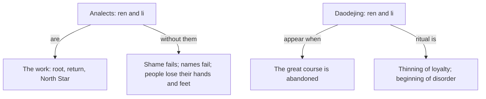

# Confucius vs Laozi — Humaneness and Rites vs Course Lost

> Whether humankindness, duty, ritual, sagacity, and filial piety are the **work** of a moral way, or the **symptoms** that the course has already been lost.

Both sides are now vault primaries: Chin's *Analects* (2014) and Ziporyn's *Daodejing* (2023). Translation layers differ — Chin: humaneness / rites / rightness / virtue / Way; Ziporyn: humankindness / ritual / duty / virtuosity / course. Same graphs; marked switch.

## The Conflict

### Position A: Humaneness and rites as the work (Confucius)

- **Core claim.** Filiality and respect for elders are "the roots of one's humanity" (1.2). Without humaneness, rites and music are useless (3.3). "Restrain the self and return to the rites" is "the way to be humane" (12.1). Guide with exemplary virtue and keep in line with the rites: the people "will have a sense of shame and will know to reform themselves" (2.3). Rule by *de* is the North Star (2.1).
- **Politics.** Rectify names first (13.3). Make the people rich, then instruct them (13.9). Do not kill to produce moral order; those at the top are wind, those below grass (12.19). Stay among human beings: "We cannot flock with birds and beasts" (18.6). Take office to understand ruler–subject rightness, knowing the Way cannot be fully realized (18.7).
- **Shared word, different use.** Shun "order[ed] the world without taking any [deliberate] action [*wuwei*]" — "He held himself respectfully and faced south — that was all" (15.5). Chin: Confucian scholars insist this is not the *Laozi*'s nondoing; both still make the ruler's cultivation the key.
- **Key anchors.** [[Thinkers/Confucius]], [[Schools/Confucianism]], [[Concepts/Ren - Humaneness (Confucius)]], [[Concepts/Li - Ritual Propriety (Confucius)]], [[Concepts/Xiao - Filiality (Confucius)]], [[Sources/The Analects - Confucius (Chin trans., 2014)]].

### Position B: Humaneness and rites as decay-markers (Laozi)

- **Core claim.** "When the great course is abandoned, humankindness and duty arise" (ch. 18). Cut off sagacity, humankindness, duty, skill, profit — embrace the undyed and the unhewn (ch. 19). Ch. 38 descent: course lost → virtuosity → humankindness → duty → ritual. "Ritual propriety is the thinning out of loyalty and trust, the beginning of disorder." Highest virtuosity "does nothing, for it harbors no motives or purposes."
- **Politics.** Highest rulers "are not even known to exist"; the people say they did it "of ourselves" (ch. 17). "I take no action and the people transform themselves" (ch. 57). More laws, more thieves. The course "conforms to how everything is when left to itself" (ch. 25).
- **Shared word, different use.** Nondoing is daily *subtraction* until "a nondoing that leaves nothing undone" (ch. 48). To do something with a thing is to ruin it (ch. 64).
- **Key anchors.** [[Thinkers/Laozi]], [[Schools/Daoism]], [[Concepts/Dao - The Course (Laozi)]], [[Concepts/De - Virtuosity and Potency (Laozi)]], [[Concepts/Wu Wei - Nondoing (Laozi)]], [[Sources/Daodejing - Laozi (Ziporyn trans., 2023)]].

## What Each Side Already Concedes

- **Confucius** already knows the recluse's case and does not sneer it off. The man with the basket (14.39): if no one understands, keep it to yourself and wade according to the depth. Jie Yu: "Leave off… Dangerous are those in office today" (18.5) — Confucius got down to speak; the madman fled. Chin: the desire to go with him was strong; he resisted. 15.5 *wuwei* is in *his* mouth.
- **Laozi** keeps the word *de* and the "effortless" that *Analects* 2.1 / 2.3 also want (Ziporyn's Note flagged those passages). Ch. 38 discards the humankindness/duty/ritual *stack*, not the idea that the highest does not strain.
- **Chin on 15.5**: "Some differences do exist, but it is also true that both teachings emphasize the ruler's cultivation as key to an ordered world." That overlap is real. It does not cancel chs. 18–19 and 38.

## Do Not Flatten

- This is not "action vs inaction." Confucius's Shun faces south; Laozi's sage subtracts until there is no task. Different *wuwei*.
- This is not "social vs individual." Both are political. Laozi has a program (unhewn simplicity, small state, unused weapons). Confucius has a program (names, trust, rich then instruct).
- The *Zhuangzi* is still outstanding. Do not let later inner-chapter irony speak for either primary.
- Mencius and Xunzi are still outstanding. Do not let "Confucianism" on this page mean their theories of nature.

## Sources

- [[Sources/The Analects - Confucius (Chin trans., 2014)]]
- [[Sources/Daodejing - Laozi (Ziporyn trans., 2023)]]

## Related

- [[Thinkers/Confucius]], [[Thinkers/Laozi]], [[Schools/Confucianism]], [[Schools/Daoism]]
- [[Thinkers/Sun Tzu]] (third classical Chinese voice: strategic *tao*, not either moral way or nonpurposive course)
