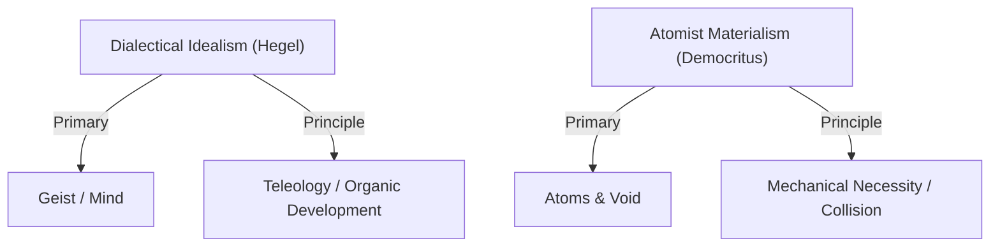

# Dialectical Idealism vs. Atomist Materialism

> The master division in metaphysics and cosmology concerning whether the universe is ultimately an organic, teleological self-unfolding of mind or spirit (Idealism) or a blind, mechanical assembly of material particles in empty space (Materialism).

## The Conflict

### Position A: Dialectical Idealism
*   **Core Claim**: Matter is not the fundamental substance of reality. The physical universe is "Spirit in its otherness"—a necessary but subordinate phase through which **Geist (Spirit/Mind)** develops. The universe is organic, rational, and directed toward a final purpose (teleology): the realization of absolute freedom and self-consciousness.
*   **Mechanism**: Reality unfolds dialectically; change is driven by conceptual contradictions that resolve into higher unifications. Human history and culture are the primary vehicles through which the cosmos achieves self-knowledge.
*   **Key Anchors**: [[Thinkers/Hegel]], [[Concepts/Geist (Absolute Spirit)]], [[Concepts/Cunning of Reason (Hegel)]].

### Position B: Atomist Materialism
*   **Core Claim**: There is no cosmic mind, spirit, or teleology. The universe consists entirely of indivisible physical particles (**atoms**) of varying shapes moving mechanically through empty space (**the void**).
*   **Mechanism**: All change is explained by the blind collision, interlocking, and separation of atoms governed by strict mechanical necessity. Life and mind are emergent products of specific atomic configurations and dissolve upon death.
*   **Key Anchors**: [[Thinkers/Democritus]], [[Thinkers/Epicurus]], [[Thinkers/Lucretius]], [[Concepts/Atomism - Atoms and Void (Leucippus and Democritus)]], [[Concepts/Epicurean Atomism (Swerve)]].

## Implications for the Vault

-   **The Nature of Evolution and Technology**: This split shapes how modern systems (like Kevin Kelly's exotropic technium, Kurzweil's singularity, or Norbert Wiener's cybernetics) are interpreted. Does technology have a "want" or teleological direction (converging with Hegel's Geist), or is it a blind, self-assembling mechanical process (converging with atomist materialism)?
-   **Mind-Body Resolution**: Idealism resolves the mind-body problem by subsuming body/matter into mind/spirit; materialism resolves it by reducing mind/spirit to bodily/atomic interactions.

## Related Pages
- [[Thinkers/Hegel]]
- [[Thinkers/Democritus]]
- [[Thinkers/Epicurus]]
- [[Thinkers/Lucretius]]
- [[Concepts/Geist (Absolute Spirit)]]
- [[Concepts/Atomism - Atoms and Void (Leucippus and Democritus)]]
- [[Concepts/Epicurean Atomism (Swerve)]]
- [[Contradictions/Atomist Materialism vs Platonic-Aristotelian Teleology]]
