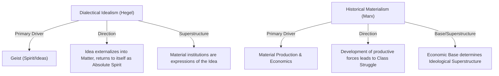

# Dialectical Idealism vs. Historical Materialism

> The major ontological and historiographical split concerning whether history is driven by the self-unfolding of ideas and consciousness (Hegel's idealism) or by concrete economic and material relations of production (Marx's materialism).

## The Conflict

### Position A: Dialectical Idealism (Hegel)
*   **Core Claim**: Reality and history are the progressive unfolding of **Geist (Spirit)** or the rational Idea. Material objects and social institutions are not self-subsisting things but are the externalized manifestations of Spirit.
*   **Mechanism**: History is a teleological process wherein Spirit undergoes a dialectical series of negations and sublations (*Aufhebung*) to overcome its self-alienation, moving toward absolute self-knowledge and freedom. Changes in human politics, law, and culture are the *results* of this evolving conceptual consciousness.
*   **Key Anchors**: [[Thinkers/Hegel]], [[Concepts/Geist (Absolute Spirit)]], [[Concepts/Dialectical Method (Hegel)]].

### Position B: Historical Materialism (Marx)
*   **Core Claim**: The real foundation of human society is the material mode of production. It is not human consciousness that determines their social being, but their social being that determines their consciousness.
*   **Mechanism**: Human history is driven by the dialectical development of the productive forces (technology, labor power) and the relations of production (property relations, division of labor). The economic **base** determines the legal, political, religious, and philosophical **superstructure**. Historical change is propelled by the contradictions between the developing forces of production and the static relations of production, which manifest as Class Struggle. Marx famously stated that he turned Hegel's dialectic "right side up," replacing the movement of the Idea with the struggle over material resources.
*   **Key Anchors**: [[Thinkers/Karl Marx]], [[Concepts/Historical Materialism (Marx)]], [[Concepts/Class Struggle (Marx)]].

## Implications for the Vault

-   **The Mind-Matter Hierarchy**: This contradiction represents the central battle line in modern philosophy of history and sociology. Does culture, philosophy, and religion shape economic structures (Idealism, as later argued by Max Weber), or do economic structures shape culture and ideas (Materialism)?
-   **Methodology of the Social Sciences**: Dialectical Idealism looks to intellectual history and conceptual development to explain change; Historical Materialism looks to empirical economic conditions, technology, and class divisions.
-   **Agency and Determinism**: In Hegelian history, individuals are often the unconscious agents of a transcendent rational process (the "Cunning of Reason"); in Marx, individuals are constrained by their class position, but class consciousness enables active, revolutionary transformation of the material world.

## Related Pages
- [[Thinkers/Hegel]]
- [[Thinkers/Karl Marx]]
- [[Concepts/Geist (Absolute Spirit)]]
- [[Concepts/Dialectical Method (Hegel)]]
- [[Concepts/Historical Materialism (Marx)]]
- [[Concepts/Class Struggle (Marx)]]
- [[Sources/Phenomenology of Spirit - Hegel (1807)]]
- [[Sources/The Communist Manifesto - Marx and Engels (1848)]]
