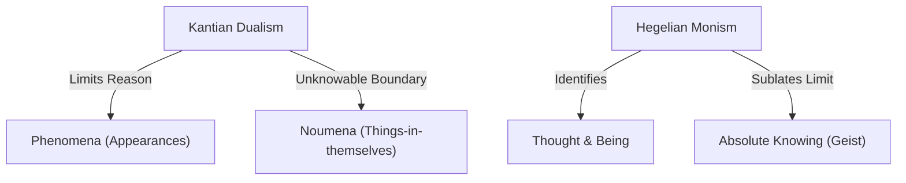

# Hegelian Monism vs. Kantian Dualism

> The fundamental epistemological and metaphysical split in German Idealism concerning whether human reason is bound by inherent limits (Kantian dualism) or can achieve absolute knowledge of the ultimate nature of reality (Hegelian monism).

## The Conflict

### Position A: Kantian Dualism (Phenomena vs. Noumena)
*   **Core Claim**: Human knowledge is strictly limited to **appearances (phenomena)**. The ultimate reality of things as they are in themselves (**noumena**) is forever unknowable to theoretical reason.
*   **Mechanism**: Knowledge requires both sensory intuition (space/time) and conceptual understanding (categories). Because we have no intellectual intuition (direct conceptual perception without senses), our categories can only be applied to sensory appearances. Any attempt to use reason to transcend appearances leads to inevitable self-contradictions (Antinomies of Pure Reason).
*   **Key Anchors**: [[Thinkers/Kant]], [[Concepts/Two Standpoints: Sensible World and Intelligible World (Kant)]].

### Position B: Hegelian Monism (The Identity of Thought and Being)
*   **Core Claim**: There is no unknowable boundary behind appearances. Reality is a unified, conceptual whole; "the Rational is the Real, and the Real is the Rational." Reason can know the thing-in-itself because the thing-in-itself is itself rational (conceptually structured).
*   **Mechanism**: Hegel argues that Kant's "thing-in-itself" is a self-contradictory concept: by defining the thing-in-itself as completely abstract and outside thought, Kant has already thought it. A boundary can only be recognized as a limit if the mind is already conceptually *beyond* it. Hegel's dialectical logic sublates the phenomena/noumena split by showing that appearances are not a veil hiding reality, but are the self-manifestation of Geist.
*   **Key Anchors**: [[Thinkers/Hegel]], [[Concepts/Geist (Absolute Spirit)]], [[Concepts/Dialectical Method (Hegel)]].

## Implications for the Vault

-   **Epistemic Humility vs. Absolute Claims**: This contradiction anchors the division between those who argue for strict limits on human (and machine) knowledge (such as Kant, Hume, or Melanie Mitchell's skepticism of AI capabilities) and those who defend systems of absolute explanation or self-unfolding intelligence (such as Hegel, Spinoza, or Kurzweil's Singularitarian optimism).
-   **The Scope of Logic**: Kant's logic remains formal and transcendental, designed to set boundaries; Hegel's logic is metaphysical and absolute, designed to chart the structure of reality itself.

## Related Pages
- [[Thinkers/Kant]]
- [[Thinkers/Hegel]]
- [[Concepts/Geist (Absolute Spirit)]]
- [[Concepts/Dialectical Method (Hegel)]]
- [[Concepts/Two Standpoints: Sensible World and Intelligible World (Kant)]]
- [[Concepts/Clear and Distinct Perception (Descartes)]]
- [[Concepts/Deus sive Natura - Substance Monism (Spinoza)]]
