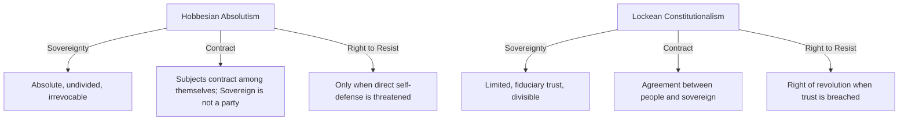

# Hobbesian Absolutism vs. Lockean Constitutionalism

> The defining debates of early modern political philosophy regarding the nature, scope, and divisibility of sovereign political authority, and whether subjects retain a right to rebel against a sovereign power.

## The Conflict

### Position A: Hobbesian Absolutism
*   **Core Claim**: Sovereign authority must be absolute, unlimited, undivided, and irrevocable. A divided or limited sovereignty (such as a constitutional government with separation of powers) is a contradiction in terms that inevitably leads to civil war and a collapse back into the brutal State of Nature.
*   **Mechanism**: The social contract is made *between the individuals* in the state of nature, who agree to transfer all their collective power and rights (except self-defense) to a sovereign. The sovereign is not a party to this contract, meaning the sovereign cannot breach it, and subjects have no legal or moral right to judge or resist the sovereign's actions.
*   **Key Anchors**: [[Thinkers/Thomas Hobbes]], [[Concepts/State of Nature (Hobbes)]], [[Concepts/Social Contract (Hobbes)]].

### Position B: Lockean Constitutionalism
*   **Core Claim**: Political power is a fiduciary trust granted by the community to protect their inherent natural rights—specifically life, liberty, and estate. Sovereign power is strictly limited by the law of nature, and if the sovereign breaches this trust, citizens have the moral right and duty to overthrow the government.
*   **Mechanism**: Individuals contract to form a political society, but they do not surrender their fundamental rights. Instead, they only delegate the executive power of the law of nature (the right to judge and punish transgressions). Government power must be divided (e.g., legislative and executive branches) and remains subject to the consent of the governed. If a ruler acts tyrannically, the trust is broken, the contract is dissolved, and the community reclaims its original authority.
*   **Key Anchors**: [[Thinkers/Locke]], [[Concepts/State of Nature, Property, and Revolution (Locke)]].

## Implications for the Vault

-   **The Nature of Political Legitimacy**: This split defines the foundational tension in modern political philosophy. Does legitimacy stem from the maintenance of absolute order and security (Hobbes), or from the preservation of individual liberty and rights (Locke)?
-   **Divisibility of Power**: The debate directly influenced the framing of modern democratic constitutions (which adopted Locke's separation of powers) and the theoretical justification of authoritarian states (which mirror Hobbes's insistence on centralized, absolute command).
-   **Revolution and Obligation**: Under Hobbes, political obligation is nearly absolute to prevent the ultimate evil of anarchy; under Locke, political obligation is conditional, framing revolution not as a crime but as a correction of a lawless ruler's rebellion against natural law.

## Related Pages
- [[Thinkers/Thomas Hobbes]]
- [[Thinkers/Locke]]
- [[Concepts/State of Nature (Hobbes)]]
- [[Concepts/Social Contract (Hobbes)]]
- [[Concepts/State of Nature, Property, and Revolution (Locke)]]
- [[Sources/Leviathan - Thomas Hobbes (1651)]]
