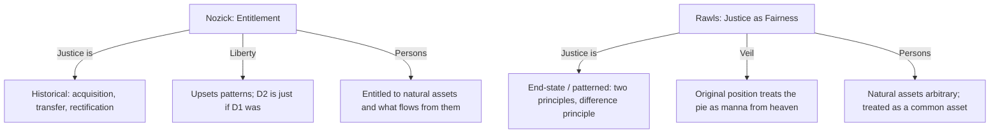

# Nozick vs Rawls — Historical Entitlement vs Patterned Justice

> Whether justice in holdings is a history of entitled moves, or a patterned / end-state profile (especially the difference principle) that institutions must continuously realize.

Rawls is **not a vault primary**. Position B is reported from Nozick’s Ch. 7 presentation of *A Theory of Justice* (1971), plus the vault’s existing Buchanan note that the “veil of uncertainty” predates Rawls’s veil of ignorance. Do not treat this page as a Rawls ingest.

## The Conflict

### Position A: Historical Entitlement (Nozick)
*   **Core Claim**: A distribution is just if everyone is entitled to the holdings they possess — by justice in acquisition, or by justice in transfer from someone entitled, or (third) by rectification of injustice. “Whatever arises from a just situation by just steps is itself just.” There is no *central* distribution.
*   **Mechanism**: Entitlement is historical and *not* patterned. The [[Arguments/Wilt Chamberlain Argument (Nozick)|Wilt Chamberlain]] case shows that any end-state or patterned principle requires continuous interference with voluntary moves. “Taxation of earnings from labor is on a par with forced labor”; patterned redistribution makes others “a *part-owner* of you.” People “are entitled to their natural assets, and to what flows from them.” The original position *cannot* yield historical principles: parties behind a veil treat holdings as “manna from heaven.”
*   **Key Anchors**: [[Thinkers/Robert Nozick]], [[Concepts/Entitlement Theory (Nozick)]], [[Arguments/Wilt Chamberlain Argument (Nozick)]], [[Concepts/Side Constraints (Nozick)]], [[Sources/Anarchy, State, and Utopia - Robert Nozick (1974)]].

### Position B: Justice as Fairness (Rawls, as Nozick presents him)
*   **Core Claim**: The principles of justice are those that would be chosen in an original position behind a veil of ignorance. They include equal basic liberties and the **difference principle**: inequalities are just only if they most improve the position of the worst-off. Natural endowments are “arbitrary from a moral point of view” and may be treated as a common asset.
*   **Mechanism**: The veil screens out knowledge of one’s place, talents, and (Nozick stresses) historical entitlements, so parties cannot choose a historical principle first. The difference principle is an end-state / patterned principle: institutions must keep the profile in a specified shape. Social cooperation is the circumstance that *creates* the problem of justice (Nozick denies this: ten Crusoes already have entitlements).
*   **Key Anchors**: John Rawls, *A Theory of Justice* (1971) — **not ingested**. Reported from ASU Ch. 7 (Nozick: unmatched “since Mill”; “undeniably great advance over utilitarianism”). Adjacent vault note: [[Concepts/Constitutional Political Economy (Buchanan-Tullock)]] records Buchanan/Tullock’s earlier “veil of uncertainty” as a precursor used to derive efficiency-maximizing rules, not the difference principle.

## What Nozick Concedes

Lavish praise; “learn from Rawls”; entitlement is “sketchy”; one need not have a complete alternative to reject Rawls, as Rawls rejected utilitarianism. Some “very weak patterns” may not be liberty-thwarted. **Rectification** is the live opening: lacking a just history, a maximin transfer scheme could be a “rough rule of thumb”; past injustice “might be so great as to make necessary in the short run a more extensive state.” The Lockean baseline “needs more detailed investigation.” He does not specify a theory of original acquisition — only its form.

## A Third Voice Already in the Vault

[[Thinkers/James M. Buchanan]] and [[Thinkers/Gordon Tullock]] (*The Calculus of Consent*, 1962) use a veil of *uncertainty* a decade before Rawls to derive constitutional rules that minimize the sum of external and decision-making costs. They do not derive a difference principle. Nozick does not discuss Buchanan in Ch. 7; the adjacency is the vault’s. All three refuse a utilitarian time-slice; they split on what replaces it (entitlement side-constraints / two principles / cost-minimizing voting rules).

## Implications for the Vault

-   **First Rawls in the wiki is one-sided.** Outstanding Sources should list *A Theory of Justice* as the hole this contradiction opens. Until that ingest, do not “close” this page.
-   **Kantian form, anti-Rawlsian content.** Nozick takes Rawls’s own charge against utilitarianism — that it does not take seriously the distinction between persons — and turns it on the difference principle and the “common asset” of talents. See [[Concepts/Side Constraints (Nozick)]] and [[Contradictions/Utilitarian Consequentialism vs. Kantian Deontology]].
-   **Locke is the historical root.** Property by labor plus “enough and as good,” restated, is what the veil is designed not to see. See [[Concepts/State of Nature, Property, and Revolution (Locke)]].

## Sources
- [[Sources/Anarchy, State, and Utopia - Robert Nozick (1974)]]
- [[Sources/The Calculus of Consent - Buchanan and Tullock (1962)]] (veil-of-uncertainty precursor only)

## Related
- [[Thinkers/Robert Nozick]] · [[Concepts/Entitlement Theory (Nozick)]] · [[Arguments/Wilt Chamberlain Argument (Nozick)]] · [[Thinkers/James M. Buchanan]] · [[Thinkers/John Stuart Mill]] · [[Thinkers/Locke]] · [[Thinkers/Kant]]
