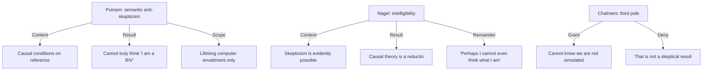

# Putnam vs Nagel — Semantic Anti-Skepticism vs Intelligible Skepticism

> Does the intelligibility of the brain-in-a-vat scenario refute causal theories of reference, or do those theories show that the scenario cannot be truly thought?

Neither Putnam 1981 nor Nagel 1986 (*The View from Nowhere*) is a vault primary. Position A is reconstructed by Pritchard and Ranalli (2016) from Putnam 1981b, with Putnam's 1994 endorsement of Wright's display. Position B is reported from the same chapter's account of Nagel 1986. Chalmers is a **third pole** already primary in the vault. Do not treat this page as a Putnam or Nagel-1986 ingest.

## The Conflict

### Position A: Semantic Anti-Skepticism (Putnam, as reconstructed)

*   **Core Claim**: Given [[Concepts/Semantic Externalism (Putnam)|content externalism]], a lifelong computer-envatted brain cannot think thoughts about brains, vats, or trees. The thought "I am a BIV" is false if one is not a BIV, and is not even *that* thought if one is. One cannot truly think it. This is a transcendental investigation of the preconditions of reference, not a claim that one *knows* one is not a BIV.
*   **Mechanism**: Causal (and communal) conditions on content. Martian-without-trees; BIV-without-trees. Vat-English is not disquotational. The stipulated scenario is permanent envattment by supercomputers.
*   **Key Anchors**: [[Thinkers/Hilary Putnam]], [[Arguments/Putnam Brain in a Vat Argument]], [[Concepts/Brain in a Vat]], [[Sources/Putnam on BIVs and Radical Skepticism - Pritchard and Ranalli (2016)]]. Putnam 1981b is **not ingested**.

### Position B: Intelligibility of Skepticism (Nagel 1986, as reported)

*   **Core Claim**: "The evident possibility and intelligibility of skepticism" refutes theories on which "tree" must mean whatever is causally responsible for tree-impressions. "Since those things could conceivably not be trees, any theory that says they have to be is wrong."
*   **Mechanism**: Two further blows. (i) The argument *exacerbates* skepticism: a BIV cannot think truly that it is a BIV, "even though others can think this about it." The leftover thought is "Perhaps I can’t even think the truth about what I am, because I lack the necessary concepts and my circumstances make it impossible for me to acquire them!" — "If this doesn’t qualify as skepticism, I don’t know what does." (ii) The BIV is only a **template** for "limitless possibilities that we can’t imagine." Traditional skeptical possibilities "stand for" ineffable ones. A reply that hits this scenario leaves those.
*   **Key Anchors**: [[Thinkers/Thomas Nagel]], *The View from Nowhere* (1986) — **not ingested**. Reported from Pritchard and Ranalli §6.6. The vault's Nagel primary is the 1974 bat essay; this is a different book.

### Position C: Third Pole (Chalmers, primary)

*   **Core Claim**: Grant that we cannot know we are not in a simulation. Deny that this undermines ordinary knowledge. Simulated objects are real ([[Concepts/Simulation Realism (Chalmers)]]). Putnam's argument, if it works, hits "brain in a vat," not "computer simulation"; "Even if I'm in a computer simulation, I can truly say, 'I'm in a computer simulation.'" Structuralism, not externalism, does the anti-skeptical work.
*   **Key Anchors**: [[Thinkers/David Chalmers]], [[Arguments/Cartesian Skepticism and the Simulation Riposte (Chalmers)]], [[Sources/Reality+ - David J. Chalmers (2022)]].

## What Each Side Concedes (as reported)

- Putnam (via Pritchard and Ranalli) already limits the result to one rendering of the BIV. Recent envattment is out of scope.
- Nagel grants that the skeptic may not be able to *explain* how terms refer if the referents do not exist; he denies that this is a refutation "unless reason has been given to believe such an account impossible."
- Chalmers grants Putnam's Knowledge-Question loss and relocates the fight to the Reality Question.

## Open

- The 2016 chapter does not adjudicate. Brueckner, Wright, and Stroud are further pressures on Position A that Nagel does not need.
- *Reason, Truth and History* (Putnam 1981) and *The View from Nowhere* (Nagel 1986) would make this two-sided from primaries.

## Sources

- [[Sources/Putnam on BIVs and Radical Skepticism - Pritchard and Ranalli (2016)]]
- [[Sources/Reality+ - David J. Chalmers (2022)]] (third pole)

## Related

- [[Thinkers/Hilary Putnam]] · [[Thinkers/Thomas Nagel]] · [[Thinkers/David Chalmers]]
- [[Arguments/Putnam Brain in a Vat Argument]]
- [[Concepts/Semantic Externalism (Putnam)]]
- [[Concepts/Brain in a Vat]]
