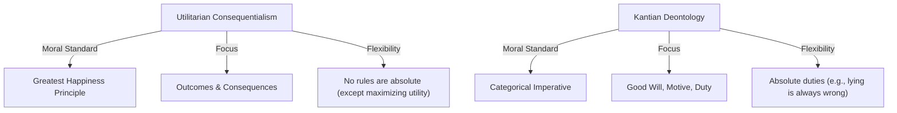

# Utilitarian Consequentialism vs. Kantian Deontology

> The primary structural opposition in modern normative ethics: whether the morality of an action is determined by its consequences (utilitarianism) or by its conformity to duty and universalizable rules (deontology).

## The Conflict

### Position A: Utilitarian Consequentialism
*   **Core Claim**: The moral worth of any action is determined solely by its outcomes. Specifically, actions are right in proportion as they tend to promote happiness, and wrong as they tend to produce the reverse of happiness (the Greatest Happiness Principle).
*   **Mechanism**: Utilitarianism is teleological and aggregative. It demands that an agent act as an impartial spectator, choosing the action that maximizes net utility (pleasure minus pain) for all affected parties. Intentions are only valuable instrumentally (if a good intention tends to produce better outcomes). No action is intrinsically wrong; a lie, theft, or even the sacrifice of an innocent person can be morally required if it leads to the best overall consequence.
*   **Key Anchors**: [[Thinkers/John Stuart Mill]], [[Concepts/Greatest Happiness Principle (Mill)]].

### Position B: Kantian Deontology
*   **Core Claim**: The moral worth of an action is determined by the agent's motive (which must be a Good Will acting out of duty alone) and the action's compliance with universal rational principles, regardless of any resulting consequences.
*   **Mechanism**: Kantian ethics is deontological and non-consequentialist. An action is morally permissible only if its underlying principle (maxim) can be consistently willed as a universal law of nature, and if it respects rational beings as ends in themselves rather than as mere means. Certain classes of actions—such as lying, breaking promises, or killing innocents—are unconditionally and absolutely prohibited, even if committing them would prevent a larger catastrophe.
*   **Key Anchors**: [[Thinkers/Kant]], [[Concepts/Categorical Imperative - Universal Law Formulation (Kant)]], [[Concepts/Formula of Humanity as End in Itself (Kant)]], [[Concepts/Good Will (Kant)]].

## Implications for the Vault

-   **The Permissibility of Sacrifice**: The debate exposes a major divergence in practical ethics: Is it permissible to sacrifice or harm one person to save many? (Utilitarianism answers yes; Kantianism answers no, as it violates the formula of humanity).
-   **Moral Absolutism vs. Relativism**: Kant defends an absolute, exceptionless moral law, whereas Mill's consequentialism is highly context-sensitive, evaluating each action based on the specific variables of the situation.
-   **Roboethics and Machine Alignment**: This tension is a central problem in AI ethics. Should an autonomous system (like a self-driving car facing a trolley problem) be programmed with a utilitarian optimization function (minimizing total harm) or a deontological ruleset (never violating specific rights, e.g., the right of a pedestrian)?

## Related Pages
- [[Thinkers/John Stuart Mill]]
- [[Thinkers/Kant]]
- [[Concepts/Greatest Happiness Principle (Mill)]]
- [[Concepts/Categorical Imperative - Universal Law Formulation (Kant)]]
- [[Concepts/Formula of Humanity as End in Itself (Kant)]]
- [[Concepts/Good Will (Kant)]]
- [[Sources/Utilitarianism - John Stuart Mill (1861)]]
